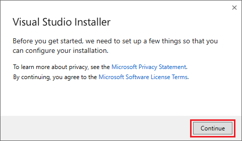
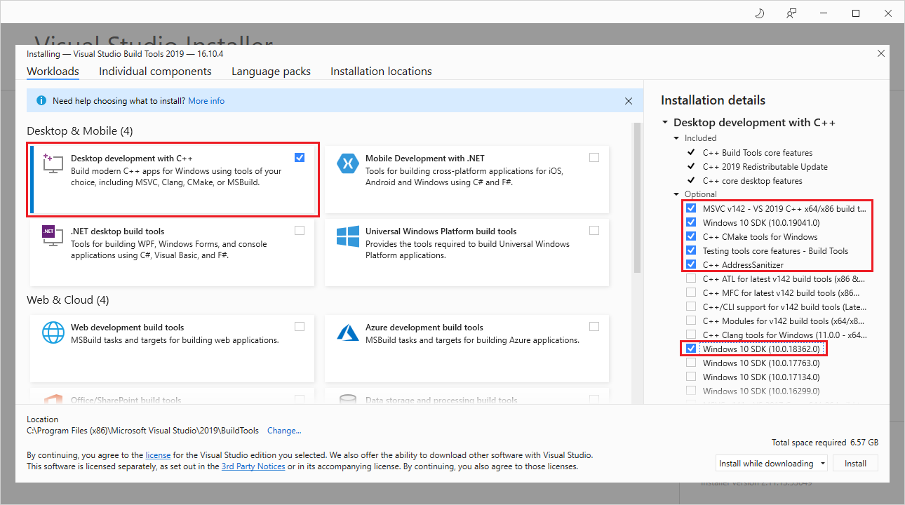
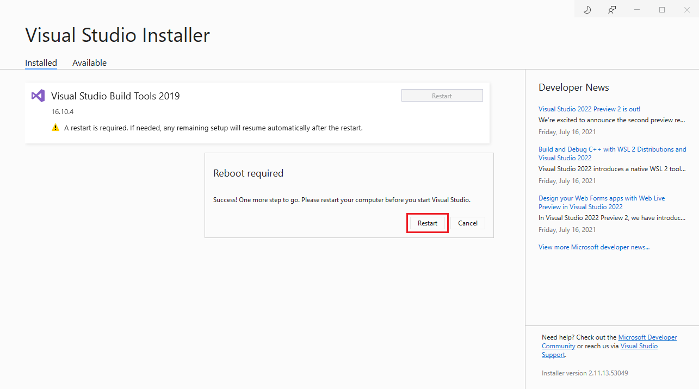

## GraalVM Native Image 21.2.0 and Basic Demos on Windows 10


There are two primary methods for installing the necessary prerequisites for creating a GraalVM native executable on Windows:

* Install Visual Studio Code + the Windows 10 SDK
* Install the Visual Studio Code Build Tools + the Windows 10 SDK

<!--Install the Windows SDK Using [Chocolatey](https://chocolatey.org/):


```
C:\> choco install -y windows-sdk-10 kb2919442
```

   or-->

### Install Prerequistes via Visual Studio Code

First, download and install Visual Studio Code 2019 via the link [here](https://visualstudio.microsoft.com/downloads/). 

Once you have Visual Studio Code installed (Community Edition will work), you'll need to add the Windows 10 SDK.

<!--Install the Windows SDK Using [Visual Studio 2019](https://visualstudio.microsoft.com/downloads/) 16.8.x (Community will work)-->

Open the Visual Studio Installer:


Under the ‘**Installed**’ tab, click on the ‘**Modify**’ button and choose ‘**Individual Components**’
 


Scroll to the bottom and make certain ‘**Windows 10 SDK**’ is installed and confirm the build tools are installed (see **Installation Details** on the right of the window).


### Install Prerequisites via Visual Studio Build Tools

If you prefer not to install Visual Studio Code 2019, you can opt to download and install the [Visual Studio Build Tools](https://visualstudio.microsoft.com/thank-you-downloading-visual-studio/?sku=BuildTools&rel=16) (C development environment).

After you download the tools, start the Visual Studio Build Tools installation:



Check the `Desktop development with C++` option and also choose the `Windows 10 SDK` on the right side of the screen and click the `Install` button.



After the installation completes, you'll need to reboot your system.




Once you have the Windows 10 SDK and the Build Tools installed, you can install GraalVM.
  
Follow the [GraalVM install instructions for Windows](https://docs.oracle.com/en/graalvm/enterprise/21/docs/getting-started/installation-windows/)

**NOTE:** You can ignore the **Prerequisites for Using Native Image on Windows** section.

Verify the GraalVM install


```
C:\> java -version
java version "11.0.12" 2021-07-20 LTS
Java(TM) SE Runtime Environment GraalVM EE 21.2.0.1 (build 11.0.12+8-LTS-jvmci-21.2-b08)
Java HotSpot(TM) 64-Bit Server VM GraalVM EE 21.2.0.1 (build 11.0.12+8-LTS-jvmci-21.2-b08, mixed mode, sharing)
```

[Download the native-image module](https://www.oracle.com/downloads/graalvm-downloads.html#license-lightbox)


Install the native-image module.


```
C:\> gu -L install .\native-image-installable-svm-svmee-java11-windows-amd64-21.2.0.1.jar
```	
**NOTE:** If you receive the following error, you'll need to run the command with Administrative privileges.

```
Error: Insufficient privileges for administration of the GraalVM installation. You need to become "BUILTIN\Administrators" user in order to perform administrative tasks on GraalVM.
NOTE: depending on your operating system, you may need to use OS tools to install or uninstall GraalVM components.
```

You'll likely need to provide the full path to the `gu` command.  In my case:

```
C:\> "C:\Program Files\Java\graalvm-ee-java11-21.2.0.1\bin\gu" install -L .\native-image-installable-svm-svmee-java11-windows-amd64-21.2.0.1.jar
```

Another option is to install the `native-image` module directly from the catalog:

```
C:\> "C:\Program Files\Java\graalvm-ee-java11-21.2.0.1\bin\gu" install native-image
Downloading: Release index file from oca.opensource.oracle.com
Downloading: Component catalog for GraalVM Enterprise Edition 21.2.0 on jdk11 from oca.opensource.oracle.com
Downloading: Component catalog for GraalVM Enterprise Edition 21.2.0.1 on jdk11 from oca.opensource.oracle.com
Skipping ULN EE channels, no username provided.
Downloading: Component catalog from www.graalvm.org
Processing Component: Native Image
Downloading: Downloading license: Oracle GraalVM Enterprise Edition Native Image License from oca.opensource.oracle.com
The component(s) Native Image requires to accept the following license: Oracle GraalVM Enterprise Edition Native Image License
Enter "Y" to confirm and accept all the license(s). Enter "R" to the see license text.
Any other input will abort installation:  Y
Please provide an e-mail address (optional). You may want to check Oracle Privacy Policy (https://www.oracle.com/legal/privacy/privacy-policy.html).
Enter a valid e-mail address: <your-email>
Downloading: Component native-image: Native Image  from oca.opensource.oracle.com
Installing new component: Native Image (org.graalvm.native-image, version 21.2.0.1)
```

Check for installed modules


```
C:\> gu list
ComponentId              Version             Component name                Stability                     Origin
---------------------------------------------------------------------------------------------------------------------------------
graalvm                  21.2.0.1            GraalVM Core                  -
js                       21.2.0.1            Graal.js                      Supported
native-image             21.2.0.1            Native Image                  Early adopter                 oca.opensource.
```

#### Launch a Command Prompt
If you have Visual Studio 2019 installed, open a Windows command prompt to start a Visual Studio Dev session:


```
C:\> "C:\Program Files (x86)\Microsoft Visual Studio\2019\Community\Common7\Tools\vcvars64.bat"
```

or if you installed only the Build Tools:

```
C:\> "C:\Program Files (x86)\Microsoft Visual Studio\2019\BuildTools\VC\Auxiliary\Build\vcvars64.bat"
```

Or launch a Dev command prompt (via Visual Studio 2019):


**Note:** On Windows, the `native-image` tool will only work when it is executed from the **x64 Native Tools Command Prompt**.

#### Create a basic application


Open your favorite editor and create a file called `HelloWorld.java`:
 
```
public class HelloWorld {
   public static void main(String[] args) {
      System.out.println("Hello, GraalVM Native Image!");
   }
}
```

Compile the app:


```
C:\> javac HelloWorld
```

Next, let's create a Native Image of the same application:


```
C:\> native-image HelloWorld

[helloworld:10284]    classlist:     956.55 ms,  0.96 GB
[helloworld:10284]        (cap):   2,525.43 ms,  0.96 GB
[helloworld:10284]        setup:   4,266.09 ms,  0.96 GB
[helloworld:10284]     (clinit):     125.53 ms,  1.19 GB
[helloworld:10284]   (typeflow):   3,513.99 ms,  1.19 GB
[helloworld:10284]    (objects):   3,226.40 ms,  1.19 GB
[helloworld:10284]   (features):     159.53 ms,  1.19 GB
[helloworld:10284]     analysis:   7,136.97 ms,  1.19 GB
[helloworld:10284]     universe:     249.78 ms,  1.19 GB
[helloworld:10284]      (parse):     593.14 ms,  1.67 GB
[helloworld:10284]     (inline):     818.67 ms,  1.67 GB
[helloworld:10284]    (compile):   7,087.49 ms,  3.19 GB
[helloworld:10284]      compile:   8,959.29 ms,  3.19 GB
[helloworld:10284]        image:     742.99 ms,  3.19 GB
[helloworld:10284]        write:     236.82 ms,  3.19 GB
[helloworld:10284]      [total]:  22,670.83 ms,  3.19 GB
```


Run the Native Image version:


```
C:\> helloworld    
Hello, GraalVM Native Image!
```

Measure Startup Time (_in PowerShell_):


```    
C:\> Measure-Command {".\helloworld"}

Days              : 0
Hours             : 0
Minutes           : 0
Seconds           : 0
Milliseconds      : 0
Ticks             : 779
TotalDays         : 9.0162037037037E-10
TotalHours        : 2.16388888888889E-08
TotalMinutes      : 1.29833333333333E-06
TotalSeconds      : 7.79E-05
TotalMilliseconds : 0.0779
    
```

Notice the application completed in .0779 milliseconds!

	
### Micronaut Example

Micronaut is a modern, JVM-based, full-stack framework for building modular, easily testable microservice and serverless applications. In fact, any Micronaut application can be compiled into a native image executable using the Micronaut Gradle or Maven plugins.

Let's get started!

You can install Micronaut using [Chocolatey](https://chocolatey.org/) or by downloading a binary.

#### Using Chocolatey


```
C:\> choco install -y micronaut
```

#### Using a Binary (or Source)

You can install Micronaut using the instructions [here](https://micronaut-projects.github.io/micronaut-starter/latest/guide/index.html#installWindows). 

The Micronaut 3.01 binary for Windows can be downloaded [here](https://github.com/micronaut-projects/micronaut-starter/releases/download/v3.0.1/mn-win-amd64-v3.0.1.zip).


Confirm that Micronaut installed successfully:

```
C:\> mn --version
Micronaut Version: 3.01
```


Next, try the **Creating Your First Micronaut Graal Application** example [here](https://guides.micronaut.io/latest/micronaut-creating-first-graal-app-maven-java.html).

NOTE: You may encounter some warning messages during the native image build but it should succeed.


```
C:\Users\Downloads\micronaut-demo> target\micronautguide.exe
 __  __ _                                  _
|  \/  (_) ___ _ __ ___  _ __   __ _ _   _| |_
| |\/| | |/ __| '__/ _ \| '_ \ / _` | | | | __|
| |  | | | (__| | | (_) | | | | (_| | |_| | |_
|_|  |_|_|\___|_|  \___/|_| |_|\__,_|\__,_|\__|
  Micronaut (v3.0.1)

12:59:20.625 [main] INFO  io.micronaut.runtime.Micronaut - Startup completed in 449ms. Server Running: http://localhost:8080
```
The native image executable starts in **449ms**.  By comparison, the JAR version of the demo app starts in **1398ms**.


```
C:\Users\Downloads\micronaut> java -jar target\micronautguide-0.1.jar
 __  __ _                                  _
|  \/  (_) ___ _ __ ___  _ __   __ _ _   _| |_
| |\/| | |/ __| '__/ _ \| '_ \ / _` | | | | __|
| |  | | | (__| | | (_) | | | | (_| | |_| | |_
|_|  |_|_|\___|_|  \___/|_| |_|\__,_|\__,_|\__|
  Micronaut (v3.0.1)

12:56:59.482 [main] INFO  io.micronaut.runtime.Micronaut - Startup completed in 1398ms. Server Running: http://localhost:8080
```


For the container build, you'll need to pass a profile flag (`-Pgraalvm`):

```
C:\Users\Downloads\micronaut> mvnw package -Dpackaging=docker-native -Pgraalvm
```

### Polyglot Example

GraalVM provides high performance runtime support for a number of languages beyond Java along with the ability to have different languages and libraries interoperate with no performance penalty. 

GraalVM makes it possible to use polyglot capabilities when building native images. In this example, we'll create a Java program that embeds some JavaScript code.

Open your favorite editor and create a file called `PrettyPrintJSON.java`:


 ```
 import java.io.*;
 import java.util.stream.*;
 import org.graalvm.polyglot.*;

 public class PrettyPrintJSON {
   public static void main(String[] args) throws java.io.IOException {
     BufferedReader reader = new BufferedReader(new InputStreamReader(System.in));
     String input = reader.lines()
     .collect(Collectors.joining(System.lineSeparator()));
     try (Context context = Context.create("js")) {
       Value parse = context.eval("js", "JSON.parse");
       Value stringify = context.eval("js", "JSON.stringify");
       Value result = stringify.execute(parse.execute(input), null, 2);
       System.out.println(result.asString());
      }
     }
 }
 ```
 
Compile the code:


```
C:\> javac PrettyPrintJSON.java
```

Create a Native Image executable:


```
C:\> native-image --language:js --initialize-at-build-time PrettyPrintJSON
```

With Windows, when you are ready to complete the input, press the `Enter` key and then press `Ctrl+Z` and then `Enter` again to complete the input _(see below)_.

Run the application:

After starting the application, enter the following JSON on the blank line:
```
{"GraalVM":{"description":"Language Abstraction Platform","supports":["combining languages","embedding languages","creating native images"],"languages": ["Java","JavaScript","Node.js", "Python", "Ruby","R","LLVM"]}}
```

Then `Enter` `CTRL-Z` `Enter`


```
C:\> prettyprintjson

{"GraalVM":{"description":"Language Abstraction Platform","supports":["combining languages","embedding languages","creating native images"],"languages": 	["Java","JavaScript","Node.js", "Python", "Ruby","R","LLVM"]}} 
	<enter> CTRL-Z <enter>
```

Here's the output you should expect:

```
{
     "GraalVM": {
      "description": "Language Abstraction Platform",
       "supports": [
         "combining languages",
         "embedding languages",
         "creating native images"
      ],
       "languages": [
          "Java",
          "JavaScript",
          "Node.js",
          "Python",
          "Ruby",
          "R",
          "LLVM"
       ]
      }
    }
```

#### Next Steps

If you're so inclined, try some additional native image samples by cloning [this repository](https://github.com/graalvm/graalvm-demos/tree/master/native-image-workshop).  The samples will walk you through a number of GraalVM Native Image features.

Have fun!