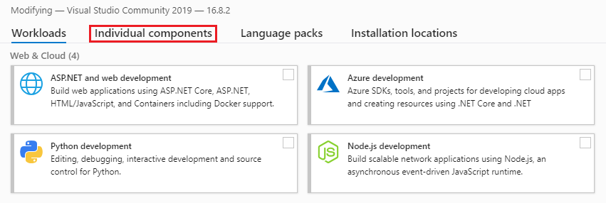

## GraalVM Native Image 21.0.0 and Basic Demos on Windows 10


Install the Windows SDK Using [Chocolatey](https://chocolatey.org/):


```
C:\> choco install -y windows-sdk-10 kb2919442
```

   or

Install the Windows SDK Using [Visual Studio 2019](https://visualstudio.microsoft.com/downloads/) 16.8.x (Community will work)

Open the Visual Studio Installer


Under the ‘**Installed**’ tab, click on the ‘**Modify**’ button and choose ‘**Individual Components**’
 



Scroll to the bottom and make certain ‘**Windows 10 SDK**’ is installed


  
Follow the [GraalVM install instructions for Windows](https://docs.oracle.com/en/graalvm/enterprise/21/docs/getting-started/installation-windows/)

Verify the GraalVM install


```
C:\> java -version
java version "11.0.10" 2021-01-19 LTS
Java(TM) SE Runtime Environment GraalVM EE 21.0.0 (build 11.0.10+8-LTS-jvmci-21.0-b06)
Java HotSpot(TM) 64-Bit Server VM GraalVM EE 21.0.0 (build 11.0.10+8-LTS-jvmci-21.0-b06, mixed mode, sharing)
```

[Download the native-image module](https://www.oracle.com/downloads/graalvm-downloads.html#license-lightbox)


Install the native-image module.


```
C:\> gu -L install .\native-image-installable-svm-svmee-java11-windows-amd64-21.0.0.jar
```	


Check for installed modules


```
C:\> gu list
ComponentId             Version             Component name      Origin
------------------------------------------------------------------------
js                       21.0.0              Graal.js           -
graalvm                  21.0.0              GraalVM Core       -
native-image             21.0.0              Native Image       Early adopter
```

Open a Windows command prompt to start a Visual Studio Dev session:


```
C:\> "C:\Program Files (x86)\Microsoft Visual Studio\2019\Community\Common7\Tools\vsdevcmd" -arch=amd64

     **********************************************************************
     ** Visual Studio 2019 Developer Command Prompt v16.8.1
     ** Copyright (c) 2020 Microsoft Corporation
     **********************************************************************
```


Or launch a Dev command prompt (via Visual Studio 2019):


**Note:** On Windows, the `native-image` tool will only work when it is executed from the **x64 Native Tools Command Prompt**.

Create a basic application (`HelloWorld.java`):


 
```
public class HelloWorld {
   public static void main(String[] args) {
      System.out.println("Hello, GraalVM Native Image!");
   }
}
```

Compile


```
C:\> javac HelloWorld
```

Create a Native Image


```
C:\> native-image HelloWorld

[helloworld:10284]    classlist:     956.55 ms,  0.96 GB
[helloworld:10284]        (cap):   2,525.43 ms,  0.96 GB
[helloworld:10284]        setup:   4,266.09 ms,  0.96 GB
[helloworld:10284]     (clinit):     125.53 ms,  1.19 GB
[helloworld:10284]   (typeflow):   3,513.99 ms,  1.19 GB
[helloworld:10284]    (objects):   3,226.40 ms,  1.19 GB
[helloworld:10284]   (features):     159.53 ms,  1.19 GB
[helloworld:10284]     analysis:   7,136.97 ms,  1.19 GB
[helloworld:10284]     universe:     249.78 ms,  1.19 GB
[helloworld:10284]      (parse):     593.14 ms,  1.67 GB
[helloworld:10284]     (inline):     818.67 ms,  1.67 GB
[helloworld:10284]    (compile):   7,087.49 ms,  3.19 GB
[helloworld:10284]      compile:   8,959.29 ms,  3.19 GB
[helloworld:10284]        image:     742.99 ms,  3.19 GB
[helloworld:10284]        write:     236.82 ms,  3.19 GB
[helloworld:10284]      [total]:  22,670.83 ms,  3.19 GB
```


Run the Native Image version


```
C:\> helloworld    
Hello, GraalVM Native Image!
```

Measure Startup Time (_in PowerShell_):


```    
C:\> Measure-Command {".\helloworld"}
    
Days              : 0
Hours             : 0
Minutes           : 0
Seconds           : 0
Milliseconds      : 3
Ticks             : 38000
TotalDays         : 4.39814814814815E-08
TotalHours        : 1.05555555555556E-06
TotalMinutes      : 6.33333333333333E-05
TotalSeconds      : 0.0038
TotalMilliseconds : 3.8
    
```
	
**Micronaut Example**

Install Micronaut using [Chocolatey](https://chocolatey.org/):


```
C:\> choco install -y micronaut
```

or

Install using instructions [here](https://micronaut-projects.github.io/micronaut-starter/latest/guide/index.html#installWindows). 


**Polyglot Example**

Edit source (`PrettyPrintJSON.java`):


 ```
 import java.io.*;
 import java.util.stream.*;
 import org.graalvm.polyglot.*;

 public class PrettyPrintJSON {
   public static void main(String[] args) throws java.io.IOException {
     BufferedReader reader = new BufferedReader(new InputStreamReader(System.in));
     String input = reader.lines()
     .collect(Collectors.joining(System.lineSeparator()));
     try (Context context = Context.create("js")) {
       Value parse = context.eval("js", "JSON.parse");
       Value stringify = context.eval("js", "JSON.stringify");
       Value result = stringify.execute(parse.execute(input), null, 2);
       System.out.println(result.asString());
      }
     }
 }
 ```
 
Compile the code:


```
C:\> javac PrettyPrintJSON.java
```

Create a Native Image:


```
C:\> native-image --language:js --initialize-at-build-time PrettyPrintJSON
```

With Windows, when you are ready to complete the input, press the `Enter` key and then press `Ctrl+Z` and then `Enter` again to complete the input _(see below)_.

Run the application:


```
C:\> prettyprintjson

{"GraalVM":{"description":"Language Abstraction Platform","supports":["combining languages","embedding languages","creating native images"],"languages": 	["Java","JavaScript","Node.js", "Python", "Ruby","R","LLVM"]}} 
	<enter> CTRL-Z <enter>

{
     "GraalVM": {
      "description": "Language Abstraction Platform",
       "supports": [
         "combining languages",
         "embedding languages",
         "creating native images"
      ],
       "languages": [
          "Java",
          "JavaScript",
          "Node.js",
          "Python",
          "Ruby",
          "R",
          "LLVM"
       ]
      }
    }
```